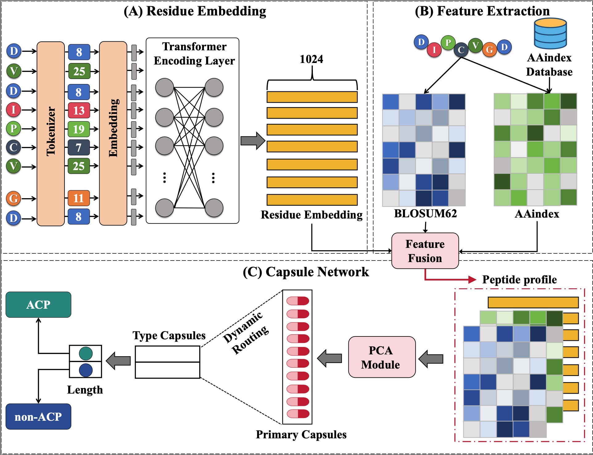

ACP-CapsPred

**A model for ACP classification and feature extraction**


## Conclusion

In this study, we proposed a two-stage computational framework, ACP-CapsPred, for predicting ACPs and their targets across various cancers. The first stage of ACP-CapsPred is dedicated to identifying ACPs, while the second stage focuses on predicting the functional activity of ACPs against different types of cancer. ACP-CapsPred integrates protein language models to extract residue embeddings and incorporates the physicochemical properties and evolutionary features of peptides to construct a comprehensive profile of peptides. Employing a next-generation neural network, specifically capsule networks, ACP-CapsPred demonstrates  state-of-the-art performance in both stages. The model exhibits notable interpretability, aiding researchers in understanding regions within the sequences associated with anticancer activity. ACP-CapsPred's convincing performance in predicting ACPs and their targets presents a novel option to expedite the development of anticancer peptides.


## Model



## 1.Train

```
python3 train.py
```


**please make sure that cuda is avaliable**

## 2.Evaluate

```
python3 evaluate.py
```

# ACP-CapsPred

## 3.Best model

our model available: [Model](https://awi.cuhk.edu.cn/dbAMP/download/software/best_model.zip)
